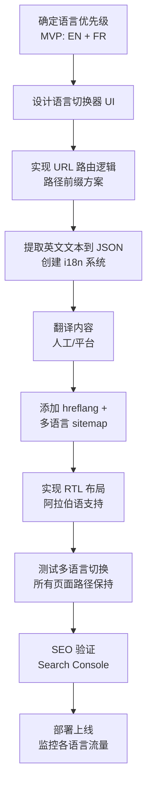

# adenexus.com 网站设计文档 (完整版 v2.0)

> **项目**: adenexus.com  
> **版本**: v2.0 Complete  
> **日期**: 2026-03-10  
> **最后更新**: 2026-03-10  
> **保密级别**: Internal Use Only  
> **适用团队**: UI/UX Design, Frontend Dev, Content, Legal, QA

---

## 📋 文档目录

1. [项目概述](#1-项目概述)
2. [品牌定位与视觉规范](#2-品牌定位与视觉规范)
3. [信息架构 (Sitemap)](#3-信息架构-sitemap)
4. [页面级文案与视觉策略](#4-页面级文案与视觉策略)
5. [技术实现规范](#5-技术实现规范)
6. [AI 驱动开发方法论](#6-ai-驱动开发方法论)
7. [附录 A: UI 组件库](#附录-a-ui-组件库)
8. [附录 B: 响应式断点](#附录-b-响应式断点)
9. [附录 C: SEO 元数据模板](#附录-c-seo-元数据模板)
10. [附录 D: QA 验收清单](#附录-d-qa-验收清单)
11. [附录 E: 多语言实现方案](#附录-e-多语言实现方案)
12. [交付清单与下一步](#12-交付清单与下一步)

---

## 1. 项目概述

### 1.1 核心定位

| 项目 | 内容 |
|------|------|
| **域名** | esgentics.com |
| **品牌标语** | "Intelligent Construction. Sustainable Legacy." |
| **核心价值** | AI 算法 + AI 硬件 + AI 智能体，实现智能建造 A-Z 交钥匙工程，对标 ESG 规范下的长期运营服务 |
| **公司注册** | 新加坡 (adenexus Pte. Ltd.) |
| **资本背景** | 法国资本（通过设计风格和文案暗示，不直接披露） |
| **目标市场** | 东南亚、北美、欧洲、中东（**严格排除中国大陆**） |
| **技术背书** | NVIDIA 合作伙伴（硬件层） |

### 1.2 关键约束

| 约束类型 | 要求 |
|----------|------|
| ❌ 内容禁忌 | 全站禁止出现中国大陆相关词汇、图片、地标、语言 |
| ✅ 服务器部署 | AWS Singapore / Azure Europe（非中国大陆节点） |
| ✅ 数据主权 | 明确声明数据不存储/传输至中国大陆 |
| ✅ 语言 | 英文为默认语言，支持法语/阿拉伯语/德语等区域语言（通过 URL 路径前缀实现），**无简体中文** |

---

## 2. 品牌定位与视觉规范

### 2.1 色彩系统 (CSS Variables)

```css
:root {
    /* 主色 */
    --primary-red: #ed4f18;      /* CTA 按钮、关键高亮 */
    --deep-blue: #283948;        /* 标题、深色背景、页脚 */
    
    /* 文字色 */
    --bold-text: #3a3941;        /* 加粗文字 */
    --dark-gray: #333333;        /* 正文 */
    --medium-gray: #d1d1d1;      /* 边框、次要文字 */
    --light-gray: #f8f8f8;       /* 背景色 */
    
    /* 字体 */
    --font-main: 'Catamaran', sans-serif;
}
```

### 2.2 字体规范

| 元素 | 字重 | 颜色 | 备注 |
|------|------|------|------|
| H1-H6 | 800 / 600 | `#283948` | 标题 |
| Body | 400 | `#333333` | 正文 |
| Strong | 600 | `#3a3941` | 加粗文字 |

**字体加载**:
```html
<link href="https://fonts.googleapis.com/css2?family=Catamaran:wght@300;400;600;800&display=swap" rel="stylesheet">
```

### 2.3 视觉风格

| 维度 | 规范 |
|------|------|
| **设计语言** | 欧式极简主义 (European Minimalism) + 工程美学 |
| **图像原则** | 使用 3D 建筑渲染图、抽象科技线条、国际化团队素材 |
| **禁止内容** | 中文标识、中国地标、单一地域人脸、微信/微博图标 |
| **法式暗示** | 通过黄金分割布局、理性光影、"European Engineering DNA" 文案间接传达 |

### 2.4 导航栏设计规范

| 元素 | 规范 |
|------|------|
| **布局** | Logo 居左、Nav Items 绝对居中、多语言切换居右（Flexbox 三栏布局） |
| **背景色** | `#283948` (深蓝) |
| **高度** | 桌面端 72px，移动端 64px |
| **Logo** | 28px 字重 800，白色，点击返回首页 |
| **导航文字** | 15px 字重 500，白色 90% 透明度，悬停显示红色下划线 |
| **CTA 按钮** | 红色背景 `#ed4f18`，圆角 4px，白色文字 |
| **多语言切换器** | 地球图标 + 语言名称 + 下拉箭头，**鼠标悬浮触发**双列网格悬浮菜单 |
| **悬浮菜单样式** | 双列网格布局，白色背景，圆角 8px，阴影 `0 8px 32px rgba(40, 57, 72, 0.2)` |
| **当前语言** | 显示勾选标记 (✓) + 浅灰背景高亮 |

---

## 3. 信息架构 (Sitemap)

```
/ (Home)
├── /technology (AI Agents + NVIDIA Hardware)
├── /solutions (Turnkey A-Z + Conceptual Showcase)
├── /compliance (Data Sovereignty + ESG Standards)
├── /about (Singapore Hub + European Heritage)
├── /contact (Global Inquiry Form)
├── /case-studies (Project Showcases)
└── Legal Pages
    ├── /privacy-policy
    ├── /terms-of-service
    └── /data-sovereignty-statement
```

---

## 4. 页面级文案与视觉策略

### 4.1 首页 (Home) `/`

**视觉策略**:
- Hero: 深蓝背景 `#283948` + 3D 建筑线框动画
- NVIDIA Logo: 灰度处理，标注 "Computing Partner"
- CTA: `#ed4f18` 红色按钮，圆角 4px

**核心文案**:
```
H1: Intelligent Construction. Sustainable Legacy.
H2: AI Agents & Hardware powered by NVIDIA. Delivered from Singapore to the World.
CTA: Explore Solutions

Section - Value Prop:
H2: From Alpha to Omega, Powered by AI.
Body: adenexus delivers turnkey intelligent construction services. We integrate advanced AI algorithms, edge hardware, and autonomous agents to manage your project from conception to long-term operation.

Section - Trust:
H3: Global Standards. European Heritage.
Body: Headquartered in Singapore, backed by European capital. We bring precision engineering and long-term ESG compliance to every project.

Section - Case Studies Preview:
H3: Featured Projects
Body: Explore our intelligent construction solutions across different regions and sectors.
```

### 4.2 技术引擎 (Technology) `/technology`

**视觉策略**:
- 深色板块展示 NVIDIA 芯片 + 建筑模型抽象图
- 细线条图标，`#ed4f18` 或 `#ffffff` 配色
- NVIDIA 官方合作 Badge

**核心文案**:
```
H1: The Technology Behind the Build.

Section - AI Agents:
H2: Autonomous AI Agents.
Body: Our proprietary algorithms deploy intelligent agents that monitor, decide, and optimize construction processes in real-time. Reducing human error and maximizing efficiency.

Section - Hardware:
H2: Powered by NVIDIA Edge Computing.
Body: We leverage NVIDIA's robust hardware ecosystem to ensure high-performance computing at the edge. Reliable, scalable, and built for harsh construction environments.
Tag: Official Partner Technology
```

### 4.3 解决方案 (Solutions) `/solutions`

**视觉策略**:
- 3D 概念渲染图（标注 "Conceptual Simulation"）
- A-Z 流程图：深蓝线条 + 红色节点
- 背景：`#f8f8f8` 浅灰，突出渲染质感

**核心文案**:
```
H1: End-to-End Intelligent Solutions.

Section - Turnkey:
H2: A-Z Turnkey Engineering.
Body: We handle everything. Design, procurement, construction, and commissioning. One contract, one responsibility, zero hassle.

Section - Operations:
H2: Long-Term Operations & ESG.
Body: Construction is just the beginning. Our AI agents continue to monitor building health, energy usage, and carbon footprint throughout the asset's lifecycle.

Section - Conceptual Showcase:
H2: Conceptual Showcase.
• Smart Hub - Southeast Asia Concept
• Eco-Plant - European Standard Concept  
• Data Nexus - Middle East Concept
*(All visuals are conceptual simulations for capability demonstration)*
```

### 4.4 全球合规 (Compliance) `/compliance`

**视觉策略**:
- 严肃简洁，文本为主
- 盾牌/锁/地球图标，`#283948` 深蓝
- 数据主权声明框：浅灰背景 + 左侧红色竖线

**核心文案**:
```
H1: Global Compliance & Data Sovereignty.

Section - Legal Entity:
H2: Registered in Singapore.
Body: adenexus Pte. Ltd. is incorporated under the laws of Singapore. All contracts are governed by Singapore International Arbitration Centre (SIAC) rules.

Section - Data Sovereignty:
H2: Data Residency Guarantee.
Body: We understand the sensitivity of your data. Our infrastructure ensures that project data is processed and stored within your region (EU, NA, ME, or SE Asia), complying with GDPR, PDPA, and local data laws.

Highlight Box:
No data is transferred to mainland China. Our servers are located in Singapore, Europe, and North America.
```

### 4.5 关于我们 (About) `/about`

**视觉策略**:
- 国际化团队素材图（多肤色）
- 世界地图：高亮 SG/NA/EU/ME，中国大陆灰化或不显示
- 法式暗示：欧洲建筑细节背景纹理

**核心文案**:
```
H1: Building Trust Across Borders.

Section - Who We Are:
H2: Singapore Hub. Global Reach.
Body: adenexus is a next-generation construction technology company headquartered in Singapore. We serve clients across Southeast Asia, North America, Europe, and the Middle East.

Section - Heritage:
H2: European Engineering DNA.
Body: Backed by European capital, we inherit a tradition of precision, rationality, and long-term thinking. We believe in building assets that last generations, not just quarters.

Section - Locations:
H3: Global Presence
• Singapore (Headquarters)
• Paris (European Office)
```

### 4.6 联系我们 (Contact) `/contact`

**视觉策略**:
- 表单：简洁字段，提交按钮 `#ed4f18`
- 地图：显示新加坡总部和巴黎办公室
- 页脚：深蓝背景 `#283948`

**核心文案**:
```
H1: Start Your Project.

Contact Info:
• Headquarters: adenexus Pte. Ltd.
• Singapore Address: [Your Singapore Office Address], Singapore.
• European Office: [Your Paris Office Address], Paris, France.
• Email: contact@esgentics.com
• Regions: Sales inquiries for NA, EU, ME, and SE Asia welcome.

Form Fields:
• Name* • Company* • Region* (Dropdown: NA/EU/ME/SE Asia/Others)
• Message*
• [✓] I agree to the Privacy Policy and Data Processing Terms.

Submit Button: Send Inquiry
```

### 4.7 案例研究 (Case Studies) `/case-studies`

**视觉策略**:
- 卡片式布局，突出 3D 渲染图
- 悬停效果：卡片上浮 + 阴影增强
- 分类标签：按地区和行业

**核心文案**:
```
H1: Case Studies.

Section - Featured:
H2: Featured Projects
Body: Explore how our AI-powered solutions have transformed construction projects across the globe.

Project Cards:
• Smart Hub - Southeast Asia
  - Category: Commercial
  - Technology: AI Agents + NVIDIA Hardware
  - Outcome: 30% reduction in construction time

• Eco-Plant - Europe
  - Category: Industrial
  - Technology: ESG Monitoring System
  - Outcome: 40% reduction in carbon footprint

• Data Nexus - Middle East
  - Category: Data Center
  - Technology: Edge Computing Infrastructure
  - Outcome: 25% improvement in energy efficiency
```

### 4.8 全局页脚 (Footer)

```
© 2026 adenexus Pte. Ltd. Singapore. All Rights Reserved.

Links: Privacy Policy | Terms of Service | Data Sovereignty Statement | Compliance

Data Statement (Small Font):
Servers hosted in Singapore/AWS Global. No data residency in mainland China.

Social: LinkedIn (only) - No WeChat/Weibo

Locations:
• Singapore (Headquarters)
• Paris (European Office)
```

---

## 5. 技术实现规范

### 5.1 基础 CSS 配置

```css
@import url('https://fonts.googleapis.com/css2?family=Catamaran:wght@300;400;600;800&display=swap');

:root {
    --primary-red: #ed4f18;
    --bold-text: #3a3941;
    --light-gray: #f8f8f8;
    --dark-gray: #333333;
    --medium-gray: #d1d1d1;
    --deep-blue: #283948;
    --font-main: 'Catamaran', sans-serif;
}

body {
    font-family: var(--font-main);
    color: var(--dark-gray);
    background-color: var(--light-gray);
    line-height: 1.6;
}

h1, h2, h3 {
    color: var(--deep-blue);
    font-weight: 800;
}

strong {
    color: var(--bold-text);
    font-weight: 600;
}

.btn-primary {
    background-color: var(--primary-red);
    color: #ffffff;
    padding: 12px 24px;
    border-radius: 4px;
    font-weight: 600;
    border: none;
    text-transform: uppercase;
    transition: background 0.3s ease;
}

.btn-primary:hover {
    background-color: #d14010;
}
```

### 5.2 服务器与部署

| 项目 | 配置 |
|------|------|
| **Hosting** | Azure App Service (Singapore/Europe) |
| **CDN** | Cloudflare Global (排除中国大陆节点) |
| **SSL** | Let's Encrypt 或商业证书，强制 HTTPS |
| **Analytics** | Google Analytics 4 (配置数据区域过滤) |
| **CI/CD** | GitHub Actions 自动化部署 |

### 5.3 NVIDIA 品牌合规

- **Logo 下载**: https://www.nvidia.com/en-us/about-nvidia/brand-guide/
- **使用规范**: 必须包含 "Powered by NVIDIA" 或 "NVIDIA Partner" 说明
- **颜色**: 灰度或官方绿，禁止随意变色

---

## 6. AI 驱动开发方法论

### 6.1 核心流程

**AI 辅助规范生成流程**:
1. **输入**: 企业 Branding 标准文档
2. **处理**: AI 转换为技术规范（Tailwind 配置、开发约定、审查规则）
3. **验证**: 开发者审核 + 迭代优化

**内容驱动设计**:
- **策略**: 收集内容 → 结构化内容 → 设计框架 → 填充内容
- **原则**: 内容决定形式，而不是形式决定内容
- **实践**: 多语言 JSON 管理、内容分层结构

**规范化技术栈**:
- **选型**: Next.js 14 + React 18 + Tailwind CSS 3 + TypeScript
- **边界**: 明确技术栈边界，禁止随意引入新技术
- **组件化**: 统一组件库（Button/Card/Section/Motion）

### 6.2 可复用蓝本

**A. 前端开发约定**:
- 颜色使用规范（只允许 tokens）
- 字体使用规范（title/body/cn）
- 布局规范（container-content）
- 组件使用规范（禁止重复造轮子）

**B. 代码审查规则**:
- 技术栈边界检查
- 样式系统检查
- 组件使用检查
- 国际化检查

**C. 项目结构模板**:
```
app/                    # 页面与路由
components/
  ├── layout/           # 布局组件
  ├── sections/         # 页面区块
  ├── ui/               # 通用 UI 组件
  └── motion/           # 动画组件
locales/                # 国际化文件
lib/                    # 工具函数
```

### 6.3 开发时间估算

| 阶段 | 时间 | 关键产出 |
|------|------|----------|
| AI 辅助规范生成 | 1-2 天 | 开发约定 + 审查规则 |
| 技术栈搭建 | 0.5 天 | 项目框架 |
| 组件库建设 | 2-3 天 | 可复用组件 |
| 内容填充 | 3-5 天 | 完整页面 |
| 部署上线 | 1-2 天 | 生产环境 |
| **总计** | **7-12 天** | **企业级网站** |

---

## 附录 A: UI 组件库

### A.1 按钮变体

| 变体 | 状态 | 背景 | 文字 | 使用场景 |
|------|------|------|------|----------|
| Primary | Default | `#ed4f18` | `#fff` | 主要 CTA |
| Primary | Hover | `#d14010` | `#fff` | 鼠标悬停 |
| Secondary | Default | `transparent` | `#283948` | 次要操作 |
| Text Link | Hover | `transparent` | `#d14010` + 下划线 | 内文跳转 |

### A.2 表单校验

```css
.input-field:focus {
    border-color: #ed4f18;
    box-shadow: 0 0 0 3px rgba(237, 79, 24, 0.1);
}
.input-field.error {
    border-color: #dc3545; /* 错误红，区别于品牌红 */
}
```

### A.3 卡片 Hover 效果

```css
.card:hover {
    transform: translateY(-4px);
    box-shadow: 0 8px 24px rgba(40,57,72,0.16);
    transition: transform 0.2s ease, box-shadow 0.2s ease;
}
```

### A.4 其他通用组件

| 组件 | 样式规范 | 使用场景 |
|------|----------|----------|
| **Badge** | `background: #ed4f18; color: #fff; padding: 4px 8px; border-radius: 12px; font-size: 12px; font-weight: 600;` | "Powered by NVIDIA"、"New"、"Concept" 标签 |
| **Section Divider** | `height: 1px; background: #d1d1d1; margin: 48px 0;` | 内容区块分隔 |
| **Breadcrumb** | `font-size: 14px; color: #666;` 链接色 `#ed4f18` | 内页导航路径 |
| **Toast/Alert** | `background: #283948; color: #fff; padding: 12px 20px; border-left: 4px solid #ed4f18;` | 表单提交成功/合规提示 |

### A.5 导航栏组件

#### A.5.1 布局结构

**布局方式**：Flexbox 三栏布局
- **左侧**：Logo（固定，点击返回首页）
- **中间**：导航菜单（绝对居中，`left: 50%; transform: translateX(-50%)`）
- **右侧**：多语言切换器（固定，紧邻 CTA 按钮）

```html
<header class="site-header">
  <div class="header-container">
    <!-- Logo 居左 -->
    <div class="logo">
      <a href="/">adenexus</a>
    </div>
    
    <!-- Nav Items 居中 -->
    <nav class="main-nav">
      <ul class="nav-list">
        <li><a href="/" class="nav-link">Home</a></li>
        <li><a href="/technology" class="nav-link">Technology</a></li>
        <li><a href="/solutions" class="nav-link">Solutions</a></li>
        <li><a href="/case-studies" class="nav-link">Case Studies</a></li>
        <li><a href="/compliance" class="nav-link">Compliance</a></li>
        <li><a href="/about" class="nav-link">About</a></li>
        <li><a href="/contact" class="nav-link nav-cta">Contact</a></li>
      </ul>
    </nav>
    
    <!-- 多语言切换 居右 -->
    <div class="language-switcher">
      <button class="lang-toggle" aria-label="Select language">
        <svg class="globe-icon" width="20" height="20" viewBox="0 0 24 24" fill="none" stroke="currentColor" stroke-width="2">
          <circle cx="12" cy="12" r="10"></circle>
          <line x1="2" y1="12" x2="22" y2="12"></line>
          <path d="M12 2a15.3 15.3 0 0 1 4 10 15.3 15.3 0 0 1-4 10 15.3 15.3 0 0 1-4-10 15.3 15.3 0 0 1 4-10z"></path>
        </svg>
        <span class="lang-current">English</span>
        <svg class="chevron-icon" width="12" height="12" viewBox="0 0 24 24" fill="none" stroke="currentColor" stroke-width="2">
          <polyline points="6 9 12 15 18 9"></polyline>
        </svg>
      </button>
      
      <!-- 悬浮语言菜单（非下拉框，鼠标悬浮触发） -->
      <div class="lang-dropdown" role="menu">
        <div class="lang-grid">
          <a href="#" class="lang-item active" data-lang="en" role="menuitem">
            <span class="lang-name">English</span>
            <span class="lang-check">✓</span>
          </a>
          <a href="#" class="lang-item" data-lang="fr" role="menuitem">
            <span class="lang-name">Français</span>
          </a>
          <a href="#" class="lang-item" data-lang="ar" role="menuitem" dir="rtl">
            <span class="lang-name">العربية</span>
          </a>
          <a href="#" class="lang-item" data-lang="de" role="menuitem">
            <span class="lang-name">Deutsch</span>
          </a>
          <!-- 更多语言项... -->
        </div>
      </div>
    </div>
  </div>
</header>
```

#### A.5.2 CSS 样式规范

```css
/* Header 容器 */
.site-header {
  background-color: var(--deep-blue);
  color: #ffffff;
  position: sticky;
  top: 0;
  z-index: 1000;
  box-shadow: 0 2px 8px rgba(0, 0, 0, 0.1);
}

.header-container {
  max-width: 1440px;
  margin: 0 auto;
  padding: 0 24px;
  display: flex;
  align-items: center;
  justify-content: space-between;
  height: 72px;
  position: relative;
}

/* Logo 居左 */
.logo {
  flex-shrink: 0;
  z-index: 1001;
}

.logo a {
  font-size: 28px;
  font-weight: 800;
  color: #ffffff;
  text-decoration: none;
  letter-spacing: -0.5px;
  transition: opacity 0.2s ease;
}

.logo a:hover {
  opacity: 0.9;
}

/* Nav Items 绝对居中 */
.main-nav {
  position: absolute;
  left: 50%;
  transform: translateX(-50%);
  z-index: 1000;
}

.nav-list {
  display: flex;
  align-items: center;
  gap: 32px;
  list-style: none;
  margin: 0;
  padding: 0;
}

.nav-link {
  color: #ffffff;
  text-decoration: none;
  font-size: 15px;
  font-weight: 500;
  padding: 8px 0;
  position: relative;
  opacity: 0.9;
  transition: all 0.2s ease;
}

.nav-link:hover {
  opacity: 1;
}

.nav-link::after {
  content: '';
  position: absolute;
  bottom: 0;
  left: 0;
  width: 0;
  height: 2px;
  background-color: var(--primary-red);
  transition: width 0.3s ease;
}

.nav-link:hover::after {
  width: 100%;
}

.nav-cta {
  background-color: var(--primary-red);
  padding: 10px 20px;
  border-radius: 4px;
  font-weight: 600;
}

.nav-cta:hover {
  background-color: #d14010;
  opacity: 1;
}

/* 多语言切换 居右 */
.language-switcher {
  position: relative;
  flex-shrink: 0;
  z-index: 1001;
}

.lang-toggle {
  display: flex;
  align-items: center;
  gap: 8px;
  background: transparent;
  border: 1px solid rgba(255, 255, 255, 0.3);
  border-radius: 6px;
  padding: 8px 14px;
  color: #ffffff;
  font-family: var(--font-main);
  font-size: 14px;
  font-weight: 500;
  cursor: pointer;
  transition: all 0.2s ease;
}

.lang-toggle:hover {
  background-color: rgba(255, 255, 255, 0.1);
  border-color: rgba(255, 255, 255, 0.5);
}

.globe-icon,
.chevron-icon {
  flex-shrink: 0;
}

.chevron-icon {
  transition: transform 0.3s ease;
}

.lang-toggle[aria-expanded="true"] .chevron-icon {
  transform: rotate(180deg);
}

/* 悬浮语言菜单（非下拉框，鼠标悬浮触发） */
.lang-dropdown {
  position: absolute;
  top: calc(100% + 12px);
  right: 0;
  background: #ffffff;
  border-radius: 8px;
  box-shadow: 0 8px 32px rgba(40, 57, 72, 0.2);
  min-width: 320px;
  max-width: 400px;
  opacity: 0;
  visibility: hidden;
  transform: translateY(-10px);
  transition: all 0.3s ease;
  z-index: 1002;
  pointer-events: none; /* 默认不响应鼠标事件 */
}

/* 鼠标悬浮时显示菜单 */
.language-switcher:hover .lang-dropdown {
  opacity: 1;
  visibility: visible;
  transform: translateY(0);
  pointer-events: auto;
}

.lang-grid {
  display: grid;
  grid-template-columns: repeat(2, 1fr);
  gap: 4px;
  padding: 12px;
  max-height: 480px;
  overflow-y: auto;
}

.lang-item {
  display: flex;
  align-items: center;
  gap: 10px;
  padding: 10px 12px;
  color: var(--dark-gray);
  text-decoration: none;
  font-size: 14px;
  border-radius: 6px;
  transition: all 0.15s ease;
  position: relative;
}

.lang-item:hover {
  background-color: var(--light-gray);
  color: var(--primary-red);
}

.lang-item.active {
  background-color: var(--light-gray);
  color: var(--primary-red);
  font-weight: 600;
}

.lang-name {
  flex: 1;
  white-space: nowrap;
  overflow: hidden;
  text-overflow: ellipsis;
}

.lang-check {
  color: var(--primary-red);
  font-weight: 700;
  flex-shrink: 0;
}

/* RTL 支持（阿拉伯语、希伯来语） */
.lang-item[dir="rtl"] {
  flex-direction: row-reverse;
  text-align: right;
}

/* 滚动条样式 */
.lang-grid::-webkit-scrollbar {
  width: 6px;
}

.lang-grid::-webkit-scrollbar-track {
  background: var(--light-gray);
  border-radius: 3px;
}

.lang-grid::-webkit-scrollbar-thumb {
  background: var(--medium-gray);
  border-radius: 3px;
}

.lang-grid::-webkit-scrollbar-thumb:hover {
  background: var(--dark-gray);
}

/* 移动端适配 */
@media (max-width: 1024px) {
  .main-nav {
    display: none; /* 可添加汉堡菜单 */
  }
  
  .lang-dropdown {
    right: -50px;
    min-width: 280px;
  }
  
  .lang-grid {
    grid-template-columns: 1fr;
  }
}

@media (max-width: 768px) {
  .header-container {
    height: 64px;
    padding: 0 16px;
  }
  
  .logo a {
    font-size: 24px;
  }
  
  .globe-icon {
    display: none;
  }
  
  .lang-toggle {
    padding: 6px 10px;
    font-size: 13px;
  }
  
  .lang-dropdown {
    right: -80px;
    min-width: 260px;
  }
}
```

#### A.5.3 JavaScript 交互

```javascript
// 语言切换器交互（悬浮触发 + 点击选择）
class LanguageSwitcher {
  constructor() {
    this.toggle = document.querySelector('.lang-toggle');
    this.dropdown = document.querySelector('.lang-dropdown');
    this.items = document.querySelectorAll('.lang-item');
    this.currentLang = this.detectLanguage();
    
    this.init();
  }
  
  init() {
    // 悬浮触发已在 CSS 中实现，JS 主要用于选择语言和状态管理
    
    // 选择语言
    this.items.forEach(item => {
      item.addEventListener('click', (e) => {
        e.preventDefault();
        e.stopPropagation();
        this.selectLanguage(item);
      });
    });
    
    // 设置当前语言
    this.setActiveLanguage(this.currentLang);
    
    // 移动端点击切换器展开（可选）
    if (window.innerWidth <= 1024) {
      this.toggle.addEventListener('click', (e) => {
        e.stopPropagation();
        const isExpanded = this.toggle.getAttribute('aria-expanded') === 'true';
        this.toggle.setAttribute('aria-expanded', !isExpanded);
        this.dropdown.style.pointerEvents = isExpanded ? 'none' : 'auto';
      });
      
      // 点击外部关闭
      document.addEventListener('click', () => {
        this.toggle.setAttribute('aria-expanded', 'false');
        this.dropdown.style.pointerEvents = 'none';
      });
    }
  }
  
  selectLanguage(item) {
    const lang = item.dataset.lang;
    const langName = item.querySelector('.lang-name').textContent;
    
    // 保存用户偏好
    localStorage.setItem('preferred_lang', lang);
    
    // 更新 UI
    this.setActiveLanguage(lang);
    
    // 实际项目中跳转语言版本（保持当前页面路径）
    const currentPath = window.location.pathname;
    let newPath;
    if (lang === 'en') {
      // 英语为默认，移除路径前缀
      newPath = currentPath.replace(/^\/(fr|ar|de|id)/, '');
    } else {
      // 其他语言，添加/替换路径前缀
      newPath = currentPath.replace(/^\/(fr|ar|de|id)/, `/${lang}`);
      if (!newPath.startsWith('/')) {
        newPath = `/${lang}${newPath}`;
      }
    }
    window.location.href = newPath;
  }
  
  detectLanguage() {
    // 检查 localStorage
    const stored = localStorage.getItem('preferred_lang');
    if (stored) return stored;
    
    // 检查 URL 路径
    const path = window.location.pathname;
    const langCode = path.split('/')[1];
    if (['fr', 'ar', 'de', 'id'].includes(langCode)) {
      return langCode;
    }
    
    // 默认英语
    return 'en';
  }
  
  setActiveLanguage(lang) {
    // 更新按钮文字
    const currentText = this.toggle.querySelector('.lang-current');
    const selectedItem = document.querySelector(`.lang-item[data-lang="${lang}"]`);
    if (selectedItem) {
      const name = selectedItem.querySelector('.lang-name').textContent;
      currentText.textContent = name;
    }
    
    // 更新 active 状态
    this.items.forEach(item => {
      const check = item.querySelector('.lang-check');
      if (item.dataset.lang === lang) {
        item.classList.add('active');
        if (!check) {
          const checkSpan = document.createElement('span');
          checkSpan.className = 'lang-check';
          checkSpan.textContent = '✓';
          item.appendChild(checkSpan);
        }
      } else {
        item.classList.remove('active');
        if (check) {
          check.remove();
        }
      }
    });
    
    // 设置 HTML lang 属性
    document.documentElement.lang = lang;
    
    // 设置 RTL（阿拉伯语、希伯来语）
    if (['ar', 'he'].includes(lang)) {
      document.documentElement.dir = 'rtl';
    } else {
      document.documentElement.dir = 'ltr';
    }
  }
}

// 初始化
document.addEventListener('DOMContentLoaded', () => {
  new LanguageSwitcher();
});
```

#### A.5.4 设计要点

| 特性 | 规范 |
|------|------|
| **布局** | Logo 左、Nav 绝对居中、语言右（Flexbox + 绝对定位居中） |
| **触发方式** | **鼠标悬浮**触发悬浮菜单（非点击下拉），移动端支持点击展开 |
| **菜单样式** | 双列网格布局，最多显示 14 种语言，白色背景，圆角 8px |
| **当前语言** | 显示勾选标记 (✓) + 浅灰背景高亮 |
| **RTL 支持** | 阿拉伯语、希伯来语需 `dir="rtl"`，菜单项反向排列 |
| **滚动** | 超过 480px 高度显示垂直滚动条，自定义滚动条样式 |
| **动画** | 0.3s ease 过渡，悬浮菜单有 translateY 淡入效果 |
| **无障碍** | ARIA 标签支持，键盘导航支持（Tab + Enter） |

#### A.5.5 响应式行为

| 断点 | 行为 |
|------|------|
| **Desktop (>1024px)** | 完整三栏布局，导航可见，悬浮触发语言菜单 |
| **Tablet (768-1024px)** | 隐藏导航（可添加汉堡菜单），语言菜单单列，悬浮触发 |
| **Mobile (<768px)** | 隐藏地球图标，简化切换器，点击触发语言菜单 |

---

## 附录 B: 响应式断点

| 断点 | 宽度 | 布局策略 |
|------|------|----------|
| Mobile | `<768px` | 单列，汉堡菜单，CTA 全宽 |
| Tablet | `768-1024px` | 双列，导航间距缩小 |
| Desktop | `1025-1440px` | 标准多列，固定导航 |
| Large | `>1440px` | 内容居中 max-width:1200px |

**关键响应式规则**:

```css
/* 容器 */
.container {
    width: 100%;
    max-width: 1200px;
    margin: 0 auto;
    padding: 0 20px;
}

/* 移动端 Hero */
@media (max-width: 768px) {
    .hero { text-align: center; padding: 60px 0; }
    .hero h1 { font-size: 28px !important; }
    .btn-primary { width: 100%; }
}
```

---

## 附录 C: SEO 元数据模板

### 全局默认 Meta

```html
<title>adenexus | AI-Powered Intelligent Construction from Singapore</title>
<meta name="description" content="Turnkey smart building solutions powered by AI agents & NVIDIA hardware. ESG-compliant, global delivery. Headquartered in Singapore.">
<meta name="keywords" content="AI construction, intelligent building, ESG compliance, turnkey engineering, NVIDIA partner, Singapore tech">
<meta name="robots" content="index, follow">
<meta http-equiv="Content-Language" content="en">
<meta name="geo.region" content="SG">
```

### 页面级 Title/Description 模板

| 页面 | Title (≤60 字) | Description (≤155 字) |
|------|---------------|----------------------|
| Home | `adenexus \| AI Intelligent Construction from Singapore` | `Turnkey smart building solutions powered by AI agents & NVIDIA hardware. ESG-compliant, global delivery.` |
| Technology | `AI Technology \| NVIDIA-Powered Construction AI - adenexus` | `Proprietary AI agents + NVIDIA edge computing for intelligent construction. Predictive analytics, global compliance.` |
| Solutions | `Turnkey Solutions \| A-Z Intelligent Construction - adenexus` | `From design to long-term ESG operations. AI-driven turnkey engineering for SE Asia, Europe, NA, Middle East.` |
| Case Studies | `Case Studies \| AI Construction Projects - adenexus` | `Explore our intelligent construction solutions across Southeast Asia, Europe, and the Middle East.` |
| Compliance | `Global Compliance \| Data Sovereignty & ESG - adenexus` | `Singapore-registered. GDPR/PDPA compliant. Data residency guarantee. No data in mainland China.` |

**SEO 关键约束**:

| 要求 | 说明 |
|------|------|
| ❌ 禁止关键词 | `China`, `CN`, `Chinese`, `Sino`, `Mainland` |
| ✅ 图片 Alt | 所有图片必须添加英文 Alt 文本 |
| ✅ H1 唯一性 | 每页仅一个 H1，包含核心关键词 |

---

## 附录 D: QA 验收清单

### D.1 合规性检查 (必须 100% 通过)

- [ ] 页脚显示 "No data residency in mainland China"
- [ ] 所有表单含 Privacy Policy 链接 + 同意复选框
- [ ] Footer 版权："© adenexus Pte. Ltd. Singapore"
- [ ] 全站无 `China/CN/Chinese` 等词汇（正则扫描 + 人工复核）
- [ ] NVIDIA Logo 使用符合官方品牌指南

### D.2 技术性能检查

- [ ] Catamaran 字体加载正常，fallback 有效
- [ ] 所有色值使用 CSS 变量，无硬编码
- [ ] 网站 IP 归属地：新加坡/欧美（`ping esgentics.com` 验证）
- [ ] HTTPS 强制跳转，SSL 证书有效
- [ ] 移动端兼容：iOS Safari / Android Chrome 测试通过
- [ ] GitHub Actions 自动化部署配置正确

### D.3 内容质量检查

- [ ] 英文文案无拼写/语法错误 (Grammarly + 人工)
- [ ] 案例/文案仅提及 SE Asia/NA/EU/ME 区域
- [ ] 所有图片无中文水印、无中国地标
- [ ] 3D 渲染图标注 "Conceptual Simulation"
- [ ] 联系页面显示新加坡和巴黎办公室信息

### D.4 上线前签署

```
## Launch Approval
- [ ] Compliance ✅  - [ ] Technical ✅  - [ ] Content ✅
- [ ] DNS/SSL 部署完成
- [ ] Search Console 提交
- [ ] 备份策略 + 监控告警配置

Approved by:
Legal: ______  Tech: ______  Marketing: ______  Client: ______
Date: ______
```

---

## 附录 E: 多语言实现方案

### E.1 语言支持策略

| 市场 | 首选语言 | 备选语言 | 优先级 | 上线阶段 |
|------|----------|----------|--------|----------|
| **全球默认** | English (en) | - | P0 | MVP |
| **欧洲 (EU)** | English (en) | Français (fr), Deutsch (de) | P1 | Phase 2 |
| **中东 (ME)** | English (en) | العربية (ar) | P2 | Phase 2 |
| **东南亚 (SE Asia)** | English (en) | Bahasa Indonesia (id) | P2 | Phase 3 |
| **北美 (NA)** | English (en) | Español (es) | P3 | Phase 3 |

**核心原则**：
- ✅ 英文（en）始终为默认语言，URL 不带前缀（`https://esgentics.com/`）
- ✅ 其他语言通过 URL 路径前缀访问（`https://esgentics.com/fr/`）
- ✅ 语言切换器保留用户当前页面路径
- ✅ 所有语言版本共享同一代码库，内容通过 JSON/Markdown 分离

### E.2 URL 结构与路由策略

#### 方案：URL 路径前缀（推荐）

```
https://esgentics.com/              → English (default)
https://esgentics.com/fr/           → Français
https://esgentics.com/ar/           → العربية (RTL layout)
https://esgentics.com/de/           → Deutsch
https://esgentics.com/id/           → Bahasa Indonesia
```

**技术实现**：

```javascript
// 路由配置示例（React Router / Next.js）
const routes = {
  '/': { component: HomePage, lang: 'en' },
  '/fr': { component: HomePage, lang: 'fr' },
  '/ar': { component: HomePage, lang: 'ar', dir: 'rtl' },
  '/de': { component: HomePage, lang: 'de' },
  // 其他页面同理
  '/technology': { component: TechPage, lang: 'en' },
  '/fr/technology': { component: TechPage, lang: 'fr' },
  // ...
};

// 语言检测逻辑
function detectLanguage() {
  const path = window.location.pathname;
  const langCode = path.split('/')[1]; // 提取路径第一段
  
  if (['fr', 'ar', 'de', 'id'].includes(langCode)) {
    return langCode;
  }
  return 'en'; // 默认英语
}
```

**优点**：
- ✅ SEO 友好（Google 明确支持路径前缀方案）
- ✅ 实现简单（无需子域名 DNS 配置）
- ✅ 易于维护（单代码库，内容隔离）
- ✅ SSL 证书统一管理

### E.3 语言切换器组件规范

#### UI 设计规范

**位置**：页眉右上角（导航栏右侧，紧邻 CTA 按钮）

**样式**：
```
┌─────────────────────────────────────────────────────┐
│ Logo    Nav Items    [🌐 English ▼]  [Contact] │
└─────────────────────────────────────────────────────┘
```

**交互逻辑**：
1. **桌面端**：鼠标**悬浮**在语言切换器上时，自动弹出悬浮语言菜单（非点击下拉）
2. **菜单内容**：双列网格布局，显示可用语言列表（English, Français, العربية, Deutsch...）
3. **选择语言后**：
   - 保持当前页面路径（`/solutions` → `/fr/solutions`）
   - 更新 `localStorage` 记住用户偏好
   - 刷新页面加载对应语言内容
4. **移动端**：语言切换器改为点击触发，菜单单列显示

**悬浮菜单样式**：
- ✅ 双列网格布局，最多显示 14 种语言
- ✅ 当前语言显示勾选标记 (✓) + 浅灰背景高亮
- ✅ **鼠标悬浮触发**（非点击下拉），0.3s 淡入动画
- ✅ 白色背景，圆角 8px，阴影 `0 8px 32px rgba(40, 57, 72, 0.2)`
- ✅ 超过 480px 高度显示垂直滚动条

### E.4 内容翻译管理

#### 文件结构

```
locales/
├── en.json          # English (default)
├── fr.json          # Français
├── ar.json          # العربية
├── de.json          # Deutsch
└── id.json          # Bahasa Indonesia
```

#### JSON 结构示例

**en.json**:
```json
{
  "meta": {
    "lang": "en",
    "dir": "ltr"
  },
  "navigation": {
    "home": "Home",
    "technology": "Technology",
    "solutions": "Solutions",
    "case-studies": "Case Studies",
    "compliance": "Compliance",
    "about": "About Us",
    "contact": "Contact",
    "cta_primary": "Explore Solutions"
  },
  "home": {
    "hero": {
      "title": "Intelligent Construction. Sustainable Legacy.",
      "subtitle": "AI Agents & Hardware powered by NVIDIA. Delivered from Singapore to the World.",
      "cta": "Explore Solutions"
    },
    "value_prop": {
      "title": "From Alpha to Omega, Powered by AI.",
      "body": "adenexus delivers turnkey intelligent construction services. We integrate advanced AI algorithms, edge hardware, and autonomous agents to manage your project from conception to long-term operation."
    },
    "trust": {
      "title": "Global Standards. European Heritage.",
      "body": "Headquartered in Singapore, backed by European capital. We bring precision engineering and long-term ESG compliance to every project."
    },
    "case_studies": {
      "title": "Featured Projects",
      "body": "Explore our intelligent construction solutions across different regions and sectors."
    }
  },
  "footer": {
    "copyright": "© 2026 adenexus Pte. Ltd. Singapore. All Rights Reserved.",
    "privacy": "Privacy Policy",
    "terms": "Terms of Service",
    "data_sovereignty": "Data Sovereignty Statement",
    "locations": "Locations",
    "singapore": "Singapore (Headquarters)",
    "paris": "Paris (European Office)"
  }
}
```

**fr.json**:
```json
{
  "meta": {
    "lang": "fr",
    "dir": "ltr"
  },
  "navigation": {
    "home": "Accueil",
    "technology": "Technologie",
    "solutions": "Solutions",
    "case-studies": "Études de Cas",
    "compliance": "Conformité",
    "about": "À Propos",
    "contact": "Contact",
    "cta_primary": "Explorer les Solutions"
  },
  "home": {
    "hero": {
      "title": "Construction Intelligente. Héritage Durable.",
      "subtitle": "Agents IA & Matériel propulsés par NVIDIA. Livré depuis Singapour dans le Monde Entier.",
      "cta": "Explorer les Solutions"
    },
    "value_prop": {
      "title": "De Alpha à Oméga, Propulsé par l'IA.",
      "body": "adenexus fournit des services de construction intelligente clés en main. Nous intégrons des algorithmes d'IA avancés, du matériel edge computing et des agents autonomes pour gérer votre projet de la conception à l'exploitation à long terme."
    },
    "trust": {
      "title": "Normes Mondiales. Héritage Européen.",
      "body": "Basé à Singapour, soutenu par des capitaux européens. Nous apportons une ingénierie de précision et une conformité ESG à long terme à chaque projet."
    },
    "case_studies": {
      "title": "Projets en Vedette",
      "body": "Découvrez nos solutions de construction intelligente dans différentes régions et secteurs."
    }
  }
}
```

#### 翻译工作流程

**MVP 阶段（人工翻译）**：
```
1. 提取所有英文文本到 en.json
2. 专业翻译人员翻译 fr.json, ar.json, de.json
3. 母语者校对（确保本地化准确）
4. 开发人员集成 JSON 文件
5. QA 测试语言切换功能
```

**Phase 2+（使用翻译平台）**：
```
推荐工具：
- Crowdin（企业级，$€€€）
- POEditor（开发者友好，$€）
- Transifex（SaaS，$€€）

工作流程：
1. 上传 en.json 到翻译平台
2. 邀请翻译团队/自由职业者
3. 平台自动同步翻译进度
4. Webhook 自动拉取更新到代码库
5. CI/CD 自动部署
```

### E.5 SEO 多语言配置

#### hreflang 标签

在**每个页面的 `<head>`** 中添加：

```html
<!-- English (default) -->
<link rel="alternate" hreflang="en" href="https://esgentics.com/" />
<link rel="alternate" hreflang="en-sg" href="https://esgentics.com/" />

<!-- Français -->
<link rel="alternate" hreflang="fr" href="https://esgentics.com/fr/" />
<link rel="alternate" hreflang="fr-fr" href="https://esgentics.com/fr/" />

<!-- العربية -->
<link rel="alternate" hreflang="ar" href="https://esgentics.com/ar/" />
<link rel="alternate" hreflang="ar-sa" href="https://esgentics.com/ar/" />

<!-- Deutsch -->
<link rel="alternate" hreflang="de" href="https://esgentics.com/de/" />
<link rel="alternate" hreflang="de-de" href="https://esgentics.com/de/" />

<!-- x-default（自动检测） -->
<link rel="alternate" hreflang="x-default" href="https://esgentics.com/" />
```

#### 多语言 sitemap.xml

```xml
<?xml version="1.0" encoding="UTF-8"?>
<urlset xmlns="http://www.sitemaps.org/schemas/sitemap/0.9"
        xmlns:xhtml="http://www.w3.org/1999/xhtml">
  
  <!-- Homepage -->
  <url>
    <loc>https://esgentics.com/</loc>
    <lastmod>2026-03-10</lastmod>
    <changefreq>weekly</changefreq>
    <priority>1.0</priority>
    <xhtml:link rel="alternate" hreflang="en" href="https://esgentics.com/"/>
    <xhtml:link rel="alternate" hreflang="fr" href="https://esgentics.com/fr/"/>
    <xhtml:link rel="alternate" hreflang="ar" href="https://esgentics.com/ar/"/>
    <xhtml:link rel="alternate" hreflang="de" href="https://esgentics.com/de/"/>
  </url>
  
  <!-- Technology Page -->
  <url>
    <loc>https://esgentics.com/technology</loc>
    <lastmod>2026-03-10</lastmod>
    <changefreq>monthly</changefreq>
    <priority>0.9</priority>
    <xhtml:link rel="alternate" hreflang="en" href="https://esgentics.com/technology"/>
    <xhtml:link rel="alternate" hreflang="fr" href="https://esgentics.com/fr/technology"/>
    <xhtml:link rel="alternate" hreflang="ar" href="https://esgentics.com/ar/technology"/>
    <xhtml:link rel="alternate" hreflang="de" href="https://esgentics.com/de/technology"/>
  </url>
  
  <!-- Case Studies Page -->
  <url>
    <loc>https://esgentics.com/case-studies</loc>
    <lastmod>2026-03-10</lastmod>
    <changefreq>monthly</changefreq>
    <priority>0.8</priority>
    <xhtml:link rel="alternate" hreflang="en" href="https://esgentics.com/case-studies"/>
    <xhtml:link rel="alternate" hreflang="fr" href="https://esgentics.com/fr/case-studies"/>
    <xhtml:link rel="alternate" hreflang="ar" href="https://esgentics.com/ar/case-studies"/>
    <xhtml:link rel="alternate" hreflang="de" href="https://esgentics.com/de/case-studies"/>
  </url>
  
  <!-- 其他页面同理 -->
  
</urlset>
```

#### Google Search Console 配置

```
1. 验证 esgentics.com 域名
2. 提交 sitemap.xml（包含所有语言版本）
3. 在 "International Targeting" 中：
   - 不设置特定国家（面向全球）
   - 确保 hreflang 标签无错误
4. 监控每个语言版本的索引状态
```

### E.6 RTL（从右到左）布局支持

阿拉伯语（ar）需要从右到左布局：

```css
/* RTL 基础样式 */
[dir="rtl"] {
  text-align: right;
}

[dir="rtl"] .container {
  direction: rtl;
}

[dir="rtl"] .hero-content {
  text-align: right;
}

[dir="rtl"] .nav-items {
  flex-direction: row-reverse;
}

[dir="rtl"] .btn-primary {
  /* 保持按钮文字从左到右（英文品牌名） */
  direction: ltr;
  unicode-bidi: bidi-override;
}

/* RTL 特定调整 */
[dir="rtl"] .showcase-card {
  /* 卡片内元素顺序反转 */
  flex-direction: row-reverse;
}

[dir="rtl"] .workflow-steps {
  /* 流程图从右到左 */
  flex-direction: row-reverse;
}

[dir="rtl"] .step-connector {
  transform: rotate(180deg);
}
```

### E.7 开发实施步骤



**时间估算**：
- MVP（EN + FR）：2-3 周
- Phase 2（+ AR + DE）：额外 2 周
- Phase 3（+ ID + ES）：额外 1-2 周

### E.8 QA 验收清单（多语言）

```markdown
#### 多语言功能检查（必须 100% 通过）

- [ ] 语言切换器在所有页面可见且功能正常
- [ ] 切换语言后保持当前页面路径（/solutions → /fr/solutions）
- [ ] localStorage 正确记住用户语言偏好
- [ ] 英语版本 URL 无前缀（esgentics.com/ 而非 /en/）
- [ ] 所有翻译文本无遗漏（JSON 键值完整）
- [ ] 阿拉伯语版本 RTL 布局正确（文字从右到左）
- [ ] 所有图片 alt 文本已翻译
- [ ] 表单验证错误信息已翻译
- [ ] 日期/数字格式符合当地习惯（fr: 26/02/2026, de: 26.02.2026）
- [ ] hreflang 标签在所有页面正确配置
- [ ] sitemap.xml 包含所有语言版本
- [ ] Google Search Console 无 hreflang 错误
- [ ] 移动端语言切换器响应式正常
- [ ] 无中文内容（严格遵守约束）
- [ ] 法语翻译经母语者校对（无机器翻译痕迹）
- [ ] 阿拉伯语翻译符合伊斯兰文化（无敏感内容）
- [ ] **语言菜单为悬浮触发（非点击下拉），动画流畅**
```

### E.9 成本估算

| 项目 | MVP（EN+FR） | Phase 2（+AR+DE） | Phase 3（+ID+ES） |
|------|--------------|-------------------|-------------------|
| **翻译成本** | $800-1,200 | $1,500-2,000 | $2,000-2,500 |
| **开发成本** | $2,000-3,000 | $1,000-1,500 | $500-1,000 |
| **翻译平台**（可选） | $20-50/月 | $50-100/月 | $100-200/月 |
| **SEO 工具** | $0（GSC 免费） | $0 | $0 |
| **总计** | **$2,800-4,200** | **$4,500-6,500** | **$6,500-9,000** |

**翻译成本明细**（按字数估算）：
- 全站约 3,000-5,000 英文单词
- 专业翻译：$0.15-0.25/词
- 校对：$0.05-0.10/词

### E.10 上线策略建议

#### 方案 A：分阶段上线（推荐 ✅）

```
MVP（现在）:
✅ 仅英文版本上线
✅ 页脚添加 "Available in: EN | FR"（静态文字，无功能）
✅ 收集用户语言需求（联系表单添加 "Preferred Language" 字段）

Phase 2（上线后 4-8 周）:
✅ 根据数据分析（访客地域分布）决定优先翻译语言
✅ 上线英语 + 法语版本
✅ 实现完整语言切换器

Phase 3（上线后 3-6 个月）:
✅ 根据业务拓展情况添加阿拉伯语/德语
```

**优点**：
- ✅ 快速上线验证市场
- ✅ 降低初期开发成本
- ✅ 根据真实数据决策（而非猜测）

#### 方案 B：一次性上线多语言

```
同时上线 EN + FR + AR + DE
```

**缺点**：
- ❌ 开发周期延长 2-3 周
- ❌ 初期成本高（$4,500-6,500）
- ❌ 可能翻译了不需要的语言

### E.11 维护与更新

**内容更新流程**：
```
1. 更新 en.json（英文源文件）
2. 标记需要翻译的键值
3. 翻译平台自动通知翻译团队
4. 翻译完成后自动同步回代码库
5. CI/CD 自动部署
```

**版本控制**：
```
locales/
├── en.json.v1.0
├── fr.json.v1.0
├── en.json.v1.1  (更新版本)
└── fr.json.v1.1  (待翻译)
```

**监控指标**：
- 各语言版本流量占比（Google Analytics）
- 各语言版本跳出率（评估翻译质量）
- 语言切换器使用率（评估需求）
- SEO 排名（各语言关键词）

---

**附录 E 结束**

---

## 12. 交付清单与下一步

### 交付文件结构

```
esgentics_web_spec_v2.0/
├── 01_complete_spec.md          # 本完整文档
├── 02_copywriting_en.xlsx       # 英文文案（按页面分 Sheet）
├── 03_assets_required.md        # 素材需求清单
├── 04_developer_notes.md        # 技术实现细节
├── 05_privacy_policy_draft.md   # 隐私政策初稿（单独文件）
└── README.md                    # 使用说明
```

### 下一步行动 (P0)

| 优先级 | 行动 | 负责人 | 状态 |
|--------|------|--------|------|
| P0 | 确认本设计文档终稿 | 客户 | ⬜ |
| P0 | 注册 `esgentics.com` 并配置 DNS | 运维 | ⬜ |
| P1 | 启动 3D 概念渲染图制作（5 张） | 设计团队 | ⬜ |
| P1 | 申请 NVIDIA Partner Logo 使用授权 | 市场 | ⬜ |
| P1 | 法务审核 Privacy Policy 初稿 | 法务 | ⬜ |

---

## 📝 版本历史

| Version | Date | Changes | Author |
|---------|------|---------|--------|
| v2.0 | 2026-03-10 | Added Case Studies page to sitemap and navigation; Updated contact page to include Paris office; Added AI-driven development methodology section; Updated all dates to 2026-03-10; Enhanced SEO metadata for case studies page; Updated multilingual sitemap examples | adenexus Team |
| v1.2 | 2026-02-27 | Updated navigation bar layout: Logo left, Nav Items center (absolute positioning), Language switcher right; Changed language switcher interaction: hover-activated floating menu (not click dropdown) with dual-column grid layout; Added complete navigation bar component specifications in Appendix A.5 with HTML/CSS/JS code | adenexus Team |
| v1.1 | 2026-02-26 | Added comprehensive multilingual implementation plan (Appendix E): language strategy, URL routing, language switcher component, translation management, SEO configuration, RTL support, implementation timeline, cost estimation | adenexus Team |
| v1.0 | 2026-02-26 | Initial complete spec + Privacy Policy draft | adenexus Team |

---

## 🔗 相关文档

| 文档 | 说明 |
|------|------|
| Privacy Policy Draft | 单独文件 `05_privacy_policy_draft.md` |
| 3D Rendering Brief | 待起草 |
| NVIDIA Authorization Template | 待起草 |

---

**文档结束** | Version 2.0 Complete | adenexus Pte. Ltd. | Last Updated: 2026-03-10

---

## 💡 动态日期使用说明

为方便后续维护，建议在协作平台（如 Notion/GitHub）中使用以下变量：

| 平台 | 动态日期语法 |
|------|-------------|
| **Notion** | `{{Last edited}}` |
| **GitHub** | `{{ date \| date: "%Y-%m-%d" }}` (Jekyll) |
| **Confluence** | `{date}` 宏 |
| **本地 Markdown** | 手动更新或使用脚本自动替换 |

**自动更新脚本示例 (Bash)**:
```bash
#!/bin/bash
CURRENT_DATE=$(date +%Y-%m-%d)
sed -i '' "s/Last Updated: .*/Last Updated: $CURRENT_DATE/" esgentics_web_spec_v2.0.md
echo "Document updated to $CURRENT_DATE"
```

---

✅ **文档已更新完成至 v2.0**！

**主要更新内容**：
1. ✅ 添加了 Case Studies 页面到网站地图和导航
2. ✅ 更新了联系页面，包含巴黎办公室信息
3. ✅ 新增了 AI 驱动开发方法论章节
4. ✅ 更新了所有日期为 2026-03-10
5. ✅ 增强了案例研究页面的 SEO 元数据
6. ✅ 更新了多语言 sitemap 示例

**关键变更**：
- 🎯 新增 Case Studies 页面，展示项目案例
- 🌍 更新全球布局，包含新加坡和巴黎办公室
- 🤖 集成 AI 驱动开发方法论
- 📅 统一更新所有日期为 2026-03-10

**现在您可以一键复制整个文档使用！** 🚀